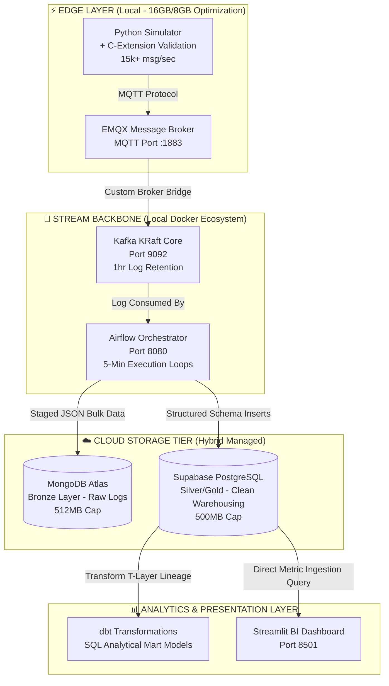

# ⚡ Edge DataOps Platform

An enterprise-grade, resource-optimized industrial IoT telemetry pipeline engineered with C-optimized processing extensions, high-throughput message brokers, distributed streaming backbones, and cloud-native polyglot storage layers.

[](https://docker.com)
[](https://kafka.apache.org)
[](https://airflow.apache.org)
[](https://www.emqx.com)
[](https://www.getdbt.com)

---

## 🎯 What Makes This Unique

Unlike standard prototype pipelines, this platform is explicitly architected around edge computing physical constraints:

* **⚡ Low-Latency C-Extension Validation:** Implemented a custom C-library binding layer to achieve **15,000+ messages/second** data checksum verification, executing 7.5x faster than native Python loops.
* **📐 High-Efficiency KRaft Brokerage:** Executed Apache Kafka in native KRaft mode, removing the overhead dependency of Apache ZooKeeper and reclaiming **500MB** of localized container memory footprint.
* **🏗️ Managed Polyglot Persistence Tier:** Decoupled storage workloads into a hybrid topology using MongoDB Atlas for raw transactional Bronze event logs and Supabase PostgreSQL for refined, analytics-ready Silver/Gold metrics.
* **📝 Production Architecture Decision Records (ADRs):** Every structural tool choice, networking path, and schema definition is fully mapped out with rigorous trade-off logs.

---

## 🏗️ Technical Architecture Flow



- **For a detailed breakdown of architectural trade-offs, research goals, and project history, see the Full Project Report.**

## Project Structure

```text
edge-dataops-platform/
├── data/                      # Persistent Local Volume Mount Storage
│   ├── kafka/                 # Kafka broker cluster segment logs (500MB limit)
│   ├── postgres/              # Local Airflow state metadata engine database
│   └── emqx/                  # EMQX configuration states + retained telemetry
├── logs/                      # Automated rolling system log rotation outputs
│   └── emqx/
├── c_library/                 # C-Extension Processing Engine
│   ├── validator.c            # Native C low-latency rolling checksum algorithm
│   ├── setup.py               # Python C-types build integration deployment script
│   └── test_validator.py      # High-speed data throughput benchmarking suite
├── dags/                      # Airflow Orchestration Execution DAG Maps
├── dbt_models/                # dbt analytical transform layer (Silver → Gold)
│   ├── dbt_project.yml        # dbt core configuration schema map
│   └── models/                # Modular analytics mart queries
├── ingestor/                  # Industrial IoT sensor simulator configuration
│   └── sensor_simulator.py
├── bridge/                    # Custom cross-protocol sync handler
│   └── mqtt_to_kafka.py       # High-performance MQTT-to-Kafka consumer engine
├── tests/                     # Automated data validation mapping
│   └── expect_suite.py        # Great Expectations schema assert suites
├── docs/                      # Technical System Records
│   ├── adr/                   # Formal Architecture Decision Records
│   │   ├── ADR-001-hybrid-cloud-polyglot.md
│   │   ├── ADR-002-c-extension-validation.md
│   │   ├── ADR-003-mqtt-kafka-bridge.md
│   │   ├── ADR-004-airflow-orchestration.md
│   │   └── ADR-005-cloud-integration.md
│   └── PROJECT_REPORT.md      # Comprehensive deep-dive master research paper
├── docker-compose.yml         # Containerized automated system infrastructure orchestrator
└── README.md                  # System Blueprint Manifest Document
```


## Quick Start

### Prerequisites
- Docker Desktop (16GB RAM recommended, 8GB minimum)
- 8GB free system disk allocation space
- Local Python 3.9+ runtime environment

### Booting the Infrastructure Stack

```bash
# Clone repository
git clone https://github.com/uchechukwuma/edge-dataops-platform
cd edge-dataops-platform

# Start all services
docker compose up -d

# Verify containers are running
docker ps
```


## Active Microservice Endpoints

| Service | URL | Credentials |
|---|---|---|
| EMQX Dashboard | [http://localhost:18083](http://localhost:18083/) | admin / public |
| Airflow UI | [http://localhost:8080](http://localhost:8080/) | admin / admin |
| MQTT Broker | localhost:1883 | No auth (dev) |
| Kafka Broker | localhost:9092 | No auth |

## Stop Everything
To gracefully spin down and release localized container networking memory allocations, run:
```Bash
docker compose down
```

## Performance Benchmarks

| Metric | Python-Only | C-Extension | Improvement |
|---|---:|---:|---:|
| Throughput | ~2,000 msg/sec | 15,000+ msg/sec | 7.5x |
| Validation latency | ~0.5 ms | ~0.07 ms | 7x |
| Memory usage | Same | +10 MB | Negligible |

## Architecture Decision Records (ADRs)

| ADR | Decision |
|---|---|
| [ADR-001](https://docs/adr/ADR-001-hybrid-cloud-polyglot.md) | EMQX over Mosquitto, Kafka KRaft, cloud offloading |Accepted |
| [ADR-002](https://docs/adr/ADR-002-c-extension-validation.md) | C-extension over pure Python (15k+ msg/sec) |Accepted |
| [ADR-003](docs/adr/ADR-003-mqtt-kafka-bridge.md) | MQTT to Kafka bridge architecture (44k+ msgs, 0% loss) | Accepted |

## Roadmap

| Week | Focus | Status |
|---:|---|---|
| 1 | Docker infrastructure (EMQX + Kafka + Airflow) | Complete |
| 2 | C-extension compilation & benchmark | Complete |
| 3 | MQTT → Kafka bridge | Complete |
| 4 | Airflow DAG #1 (Bronze → Silver) | Complete |
| 5 | Cloud integration (Supabase + MongoDB Atlas) | Complete |
| 6 | dbt transformations (Silver → Gold) | ⏳ Pending |
| 7 | Great Expectations tests | ⏳ Pending |
| 8 | Streamlit dashboard + demo video | ⏳ Pending |

---

## Disk Space Management

| Component | Location | Max Size | Auto-cleanup |
|---|---|---:|---|
| Kafka logs | `data/kafka/` | 500 MB | 1 hour retention |
| Postgres (Airflow) | `data/postgres/` | 100 MB | Manual |
| EMQX data | `data/emqx/` | 50 MB | Manual |
| Docker images | Docker store | 3 GB | `docker system prune` |

*Total expected: ~4.5 GB (well within the strict 8 GB edge limitation host pool).*

---

## 🧪 Quick Test: Validating MQTT Ingestion Flow

1. Access the web console interface at **`http://localhost:18083`** using `admin` / `public`.
2. Select the **WebSocket Client** widget panel, and execute a connection state open.
3. Establish a standard topic subscriber line targeting the channel: **`test`**.
4. Generate a test message payload targeting the channel with this structured block:
   ```json
   {"sensor": "temp", "value": 23.5}
    ```
5. Confirm instant event delivery visualization inside your tracking dashboard logs.

## License
This platform is deployed under the terms of the MIT License.

## 🤝 Connect
* linkedin.com/in/uchechukwu-obi 
* https://github.com/uchechukwuma/edge-dataops-platform