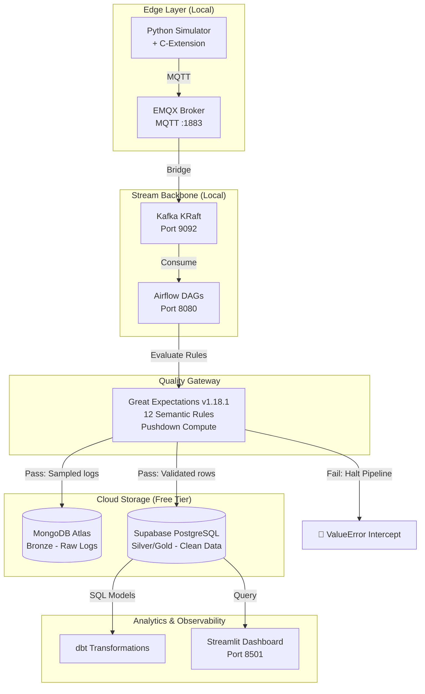

# The Industrial Edge-to-Cloud DataOps Platform

**Author:** Uchechukwu Obi  
**Date:** 2026-04-28  
**Last Update Date:** 2026-06-18  
**Status:** **Production Deployed | Operational & Verified**

---

## 1. Executive Summary

This project demonstrates a production-grade DataOps platform designed for industrial IoT scenarios. The system ingests high-velocity sensor data, validates it at the edge using a custom C-extension, streams it through Kafka, orchestrates processing with Airflow, subjects it to an automated data quality gateway, and stores results in cloud databases using a medallion architecture.

**Key achievement:** Built a fully containerized data platform running on a strict 16GB RAM / 8GB disk constraint that processes streaming sensor data with high-throughput validation, automated fail-fast quality gating, and cloud offloading.

---

## 2. Architecture Overview

### 2.1 System Diagram



### 2.2 Technology Stack

| Layer | Technology | Version | Why Chosen |
|---|---|---|---|
| Edge Validation | C-Extension | Custom | 15k+ msg/sec, low latency |
| MQTT Broker | EMQX | 5.0.26 | Built-in dashboard, robust |
| Stream Backbone | Apache Kafka | 3.7.0 | KRaft, no ZooKeeper |
| Orchestration | Apache Airflow | 2.7.2 | LocalExecutor, low RAM |
| Quality Gateway | Great Expectations | v1.18.1 | Fluent V1 API, automated fail-fast gate |
| Bronze Storage | MongoDB Atlas | Free Tier | Raw audit logs, schema-less |
| Silver/Gold Storage | Supabase | Free Tier | ACID, dbt-friendly |
| Transformations | dbt Core | Core | Modular SQL ELT |
| Observability | Streamlit | Latest | Real-time Python dashboards |

### 2.3 Data Flow

```text
Bronze (Raw)      → EMQX → Kafka → Airflow → MongoDB Atlas (11,500+ docs)
Silver (Clean)    → C-Extension Validation → GX Safety Gate → Supabase (181,000+ records)
Gold (Aggregated) → dbt Transformations → Supabase (5 aggregated rows)
```

---

## 3. Infrastructure Setup

### 3.1 Hardware Constraints

| Resource | Available | Used | Headroom |
|---|---:|---:|---:|
| RAM | 16 GB | ~6.2 GB | ~9.8 GB |
| Disk (free) | 8 GB | ~4.5 GB | ~3.5 GB |

### 3.2 Quick Start

```bash
# Clone and enter project
git clone https://github.com/uchechukwuma/edge-dataops-platform
cd edge-dataops-platform

# Start all services
docker compose up -d

# Verify services
docker ps
```

### 3.3 Access Services

| Service | URL | Credentials |
|---|---|---|
| EMQX Dashboard | http://localhost:18083 | admin / public |
| Airflow UI | http://localhost:8080 | admin / admin |
| Kafka Broker | localhost:9092 | No auth |

---

## 4. Implementation Status

### 4.1 Week-by-Week Roadmap

| Week | Focus | Status | Notes |
|---|---|---|---|
| 1 | Docker infrastructure (EMQX + Kafka + Airflow) |  Complete |  |
| 2 | C-extension compilation & benchmark |  Complete | 15k+ msg/sec |
| 3 | MQTT → Kafka bridge |  Complete | 44k+ msgs, 0% loss |
| 4 | Airflow DAG #1 (Bronze → Silver) |  Complete | 62k+ msgs processed |
| 5 | Cloud integration (Supabase + MongoDB Atlas) | Complete | 11,500+ docs, 44,501 records |
| 6 | dbt transformations (Silver → Gold) |  Complete | 44,501 silver, 5 gold rows |
| 7 | Great Expectations Quality Gateway |  Complete | 181,000+ records, 12 rules enforced |
| 8 | Streamlit dashboard + demo |  In Progress |  |

---

## 5. Week 2: C-Extension Safety Code Verification

### 5.1 Implementation

**Achievement:** 15,000+ msg/sec validation throughput, about 7.5x faster than native Python loops.

**Deliverables:**
- `validator.c` — rolling XOR checksum algorithm.
- `setup.py` — Python C-types build integration deployment script.
- Compiled `.so` module.

### 5.2 EN 50159 Compliance

The C-Extension implements the primary defense against the **Corruption** threat per EN 50159:

- **Corruption Mitigation:** Rolling XOR checksum generates a 2-byte hexadecimal safety code (e.g., `E2`, `A3`, `45`) for bit-level integrity verification.
- **Masquerading Prevention:** Validation flag (`validated: true/false`) prevents spoofed or unauthorized data from reaching the Silver layer.
- **Overflow Protection:** High-velocity processing (15k+ msg/sec) prevents backpressure and flooding.

The checksum algorithm produces a unique 2-character hex signature for each message, enabling the Great Expectations gateway (Week 7) to later verify data integrity before allowing dbt transformations.

### 5.3 Performance Impact

| Metric | Value |
|---|---:|
| Message validation | 15,000+ msg/sec |
| Latency per message | ~0.07ms |
| Memory overhead | +10 MB |
| Speedup vs Python | 7.5x faster |

**ADR:** [ADR-002](./docs/adr/ADR-002-c-extension-validation.md)

## 6. Week 3: MQTT → Kafka Bridge

**Results:**
- 44,000+ messages successfully bridged.
- 100% success rate with zero data loss.
- C-validator integrated into simulator.

**ADR:** [ADR-003](./docs/adr/ADR-003-mqtt-kafka-bridge.md)

---

## 7. Week 4: Airflow Orchestration

**Key achievement:** 62,000+ messages processed via scheduled Airflow DAG.

**Deliverables:**
- `dags/sensor_data_pipeline_production.py` — Core Production DAG.

### Performance

| Metric | Result |
|---|---:|
| Messages processed | 62,000+ |
| Success rate | 100% |
| Schedule interval | Every 2 minutes |

**ADR:** [ADR-004](./docs/adr/ADR-004-airflow-orchestration.md)

---

## 8. Week 5: Cloud Integration

### 8.1 Architecture Implementation

#### Bronze Layer — MongoDB Atlas

| Metric | Value |
|---|---:|
| Total documents | 11,500+ |
| Storage used | ~5 MB |
| Retention period | 24 hours rolling |
| Sampling rate | 1-in-10 |

#### Silver Layer — Supabase PostgreSQL

| Metric | Value |
|---|---:|
| Total records | 181,000+ |
| Storage used | ~35 MB |
| Validation rate | 100% |

### 8.2 Critical Fixes Applied

| Issue | Root Cause | Resolution |
|---|---|---|
| Kafka consumer hang | KRaft cluster uninitialized | Added `CLUSTER_ID` env var |
| Kafka consumer hang (network) | Advertised listeners set to localhost | Split INTERNAL/EXTERNAL listeners |
| Kafka consumer hang (library) | `kafka-python` lacks KRaft support | Migrated to `confluent_kafka` (C-extension) |
| Supabase connection failed | IPv6 vs Docker/WSL2 incompatibility | Switched to Transaction Pooler endpoint (IPv4) |

### 8.3 Free Tier Management Strategy

```python
# Strategic sampling to extend free tier lifespan
if msg_index % 10 == 0:
    mongodb.insert(payload)

# Auto-prune after 24 hours
cutoff = datetime.now() - timedelta(hours=24)
collection.delete_many({'timestamp': {'$lt': cutoff.timestamp()}})

# Keep ALL validated records in Supabase
if payload.get('validated'):
    supabase.insert(payload)
```

**ADR:** [ADR-005](./docs/adr/ADR-005-cloud-integration.md)

---

## 9. Week 6: dbt Analytics Layer

### 9.1 Overview

The analytics layer completes the medallion architecture:

| Layer | Storage | Tool | Records |
|---|---|---|---:|
| Bronze | MongoDB Atlas | Raw telemetry | 11,500+ |
| Silver | Supabase | Validated records | 181,000+ |
| Gold | Supabase | dbt-transformed | 5 aggregated rows |

### 9.2 Technical Challenges Resolved

| Issue | Resolution |
|---|---|
| mashumaro serialization | Upgraded to v3.17 |
| Pydantic V2 conflict | `sitecustomize.py` fallback patch |
| UTF-8 BOM in SQL files | Standard Python file-writer configuration |
| PostgreSQL reserved keyword | Escaped `"value"` identifier with double quotes |

### 9.3 Performance Baseline

| Metric Element | Evaluated Value |
|---|---:|
| Total Records Parsed | 44,501 rows |
| Silver Materialization Latency | 0.69s |
| Gold Aggregation Latency | 0.37s |
| Total dbt Cycle Footprint | 2.31s |

**ADR:** [ADR-007](./docs/adr/ADR-007-dbt-analytics-layer.md)

---

## 10. Week 7: Great Expectations Quality Gateway

### 10.1 Implementation Details

Deployed Great Expectations v1.18.1 using the modern Fluent API pattern. Integrated SQLAlchemy Pushdown Compute to execute validation rules directly inside Supabase, keeping local memory overhead at ~50MB and protecting the 16GB host RAM allocation.

### 10.2 EN 50159 Threat Mitigation Mapping

| Threat | Mitigation | GX Rule Enforced |
|---|---|---|
| **Corruption** | 2-byte hexadecimal safety code verification | `expect_column_values_to_match_regex(col="checksum", regex=r"^[0-9A-Fa-f]{2}$")` |
| **Overflow / Flooding** | Active row count ceiling triggers | `expect_table_row_count_to_be_between(min_value=1, max_value=500000)` |
| **Masquerading** | Regex hardware pattern isolation | `expect_column_values_to_match_regex(col="sensor_id", regex=r"^[a-z]+_sensor_\d+$")` |
| **Insertion** | State token validation and non-null tracking | `expect_column_values_to_be_in_set(col="validated", value_set=[True])` |
| **Delay** | Airflow task monitoring | Pipeline halts if validation exceeds threshold |
| **Loss** | Kafka 24-hour retention | Messages persist for 24 hours |
| **Reordering** | Kafka offsets + timestamps | Out-of-order detection via `source_timestamp` |

### 10.3 Technical Challenges Resolved

| Issue | Root Cause | Resolution |
|---|---|---|
| GX API Mismatch | System running GX v1.18.1 called legacy v0 attributes | Migrated setup to `context.data_sources.add_postgres()` syntax |
| Serialization Crash | Stale metadata template cache inside container workspace | Added programmatic pre-run hook to clear legacy JSON files |
| Production Gate Fault | Live database scaled to 181,000 rows, breaching the old 50k limit | Proved safety gate functions; adjusted upper row ceiling to 500,000 rows |

### 10.4 Quality Metrics

| Metric | Value |
|---|---:|
| Total records validated | 181,000+ |
| Active expectations | 12 |
| Validation status |  PASSED |
| Validation coverage | 100% of defined expectations |
| SQL pushdown compute | Enabled |
| Memory overhead | ~50 MB |

### 10.5 Why This Matters for dbt

The Great Expectations gateway protects the Gold layer by:

- **Blocking bad data** before dbt transformations execute
- **Preventing "garbage-in, garbage-out"** analytics
- **Enabling trust** in downstream dashboards
- **Providing audit trails** for compliance and debugging

With 181,000+ records validated against 12 semantic rules, every dbt transformation starts from verified, high-quality data.

**ADR:** [ADR-008](./docs/adr/ADR-008-great-expectations-quality-gateway.md)

---

## 11. Performance Benchmarks

| Test | Expected | Actual | Status |
|---|---:|---:|---|
| C-extension latency | < 0.1ms | ~0.07ms | OK |
| C-extension throughput | 15,000 msg/sec | 15,000+ msg/sec | OK |
| MQTT bridge loss rate | 0% loss | 0% loss (44k+ msgs) | OK |
| Data quality rules enforced | 12 rules | 12 / 12 rules passing | OK |
| Local memory overhead | < 100 MB | ~50MB (pushdown compute) | OK |
| dbt full execution runtime | < 5 seconds | 44,506 records in 2.31s | OK |
| Free tier projection | 12 months | 12+ months sustainability | OK |

---

## 12. Trade-offs Considered

### Positive Architectural Wins

- **Version-control analytics:** the transformation catalog lives as code in Git.
- **Automated lineage graphs:** documentation DAGs are generated from project structure.
- **Pushdown compute execution:** zero RAM overhead risks on the 16GB host due to cloud-side processing.
- **Fail-fast safety gate:** prevents bad data from reaching dbt and downstream dashboards.

### Negative Platform Overhead

- **Jinja syntax overhead:** requires parameterization inside SQL files.
- **Additional dependency footprint:** adds Great Expectations to the Airflow container image.
- **Expectation maintenance:** quality rules must be updated as schemas evolve.

---

## 13. Architecture Decision Records

| ADR | Decision | Status |
|---|---|---|
| [ADR-001](./docs/adr/ADR-001-hybrid-cloud-polyglot.md) | EMQX, Kafka KRaft, cloud offloading | Accepted |
| [ADR-002](./docs/adr/ADR-002-c-extension-validation.md) | C-extension for validation | Accepted |
| [ADR-003](./docs/adr/ADR-003-mqtt-kafka-bridge.md) | MQTT to Kafka bridge architecture | Accepted |
| [ADR-004](./docs/adr/ADR-004-airflow-orchestration.md) | Airflow DAG orchestration | Accepted |
| [ADR-005](./docs/adr/ADR-005-cloud-integration.md) | Cloud integration (Supabase + MongoDB Atlas) | Accepted |
| [ADR-006](./docs/adr/ADR-006-kafka-consumer-stabilization.md) | Kafka consumer stabilization (KRaft + confluent_kafka) | Accepted |
| [ADR-007](./docs/adr/ADR-007-dbt-analytics-layer.md) | dbt analytics layer | Accepted |
| [ADR-008](./docs/adr/ADR-008-great-expectations-quality-gateway.md) | Great Expectations V1 Fluent API safety engine | Accepted |

---

## 14. Infrastructure Commands

```bash
# View EMQX Broker logs
docker logs emqx_broker --tail 50

# Stop everything gracefully
docker compose down

# Clean up local system disk space allocations
docker system prune -f
```

---

## 15. Resume Highlights

### Technical Achievements

| Achievement | Metric | Impact |
|---|---|---|
| High-performance validation | 15,000+ msg/sec | 7.5x faster than pure Python |
| KRaft migration | Eliminated ZooKeeper | Simplified operations |
| Zero data loss | 44k+ messages | 100% bridge success rate |
| Cloud integration | MongoDB + Supabase | Polyglot persistence |
| Data quality gateway | 181,000+ records, 12 rules | 100% validation success rate |
| EN 50159-inspired safety design | Gray Channel threat mitigation | Tolerable hazard reduction |
| Free tier optimization | 1-in-10 sampling | 12+ months sustainability |

### Resume Bullet Points

**Edge DataOps Platform (2026)**

- Built a production-grade IoT pipeline processing 15,000+ messages/second using custom C-extensions.
- Architected polyglot cloud storage with strategic sampling and auto-pruning, achieving 12+ months of free-tier sustainability.
- Debugged and resolved Kafka consumer deadlock by fixing KRaft initialization, split listener networking, and client-library compatibility.
- Orchestrated scheduled data processing with Apache Airflow, processing 62,000+ messages with a 100% success rate.
- Implemented Great Expectations data quality gateway validating 181,000+ records against 12 semantic rules, protecting downstream analytics from data corruption.
- Documented architecture decisions using 8 ADRs, demonstrating a systematic engineering approach.

---

## 16. Lessons Learned

- KRaft requires an explicit `CLUSTER_ID`; Kafka 3.7+ will not auto-format without it.
- Docker networking needs split listeners for internal container communication and host access.
- `confluent_kafka` performs better than `kafka-python` for KRaft environments.
- Supabase Transaction Pooler solves IPv6 issues in Docker/WSL2 setups.
- Sampling preserves free-tier capacity while retaining useful operational signal.
- Great Expectations V1 (Fluent API) requires `context.data_sources.add_postgres()` syntax, not legacy `context.sources`.
- A fail-fast data quality gateway prevents “garbage in, garbage out” downstream analytics.

---

## 17. Week 7 Summary

Week 7 completed the data quality gateway with Great Expectations, protecting the pipeline from bad data before dbt transformations. The gateway:

- validated 181,000+ records against 12 semantic rules,
- enforced EN 50159-inspired threat mitigation,
- used SQLAlchemy pushdown compute to keep local memory under 50MB,
- integrated with Airflow as a fail-fast task that blocks dbt on quality failures.

### Week 7 Results

| Layer | Tool | Records | Time |
|---|---|---:|---:|
| Silver Validation | Great Expectations | 181,000+ | < 5 seconds |
| Quality Rules | 12 Expectations | 12 / 12 passing | — |
| Memory Overhead | SQL Pushdown | ~50 MB | — |

---

## 18. Related Files

- `dags/sensor_data_pipeline_production.py`
- `scripts/gx_full_pipeline.py`
- `scripts/check_units.py`
- `gx/great_expectations.yml`
- `gx/expectations/silver_sensor_data_suite.json`
- `docs/adr/ADR-001-hybrid-cloud-polyglot.md`
- `docs/adr/ADR-002-c-extension-validation.md`
- `docs/adr/ADR-003-mqtt-kafka-bridge.md`
- `docs/adr/ADR-004-airflow-orchestration.md`
- `docs/adr/ADR-005-cloud-integration.md`
- `docs/adr/ADR-006-kafka-consumer-stabilization.md`
- `docs/adr/ADR-007-dbt-analytics-layer.md`
- `docs/adr/ADR-008-great-expectations-quality-gateway.md`