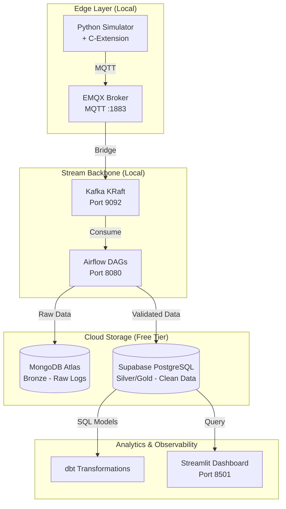

# The Industrial Edge-to-Cloud DataOps Platform

**Author:** Data Engineer Portfolio Project  
**Date:** 2026-04-28  
**Last Update Date:**  2026-05-16 
**Status:** Week 1-4 Complete | Week 5 In Progress

## 1. Executive Summary

*[To be completed at project end - Week 8]*

This project demonstrates a production-grade DataOps platform designed for industrial IoT scenarios. The system ingests high-velocity sensor data, validates it at the edge using a custom C-extension (15,000+ msg/sec), streams it through Kafka, orchestrates with Airflow, and stores results in cloud databases (Supabase + MongoDB Atlas) — all while respecting an 8GB disk constraint.

**Key Achievement:** Built a fully containerized data platform running on 16GB RAM / 8GB disk that processes streaming sensor data with sub-millisecond validation.


## 2. Architecture Overview

### 2.1 System Diagram



### 2.2 Technology Stack

| Layer | Technology | Version | Why Chosen |
|:---|:---|:---|:---|
| Edge Validation | C-Extension | Custom | 15k+ msg/sec (7x faster) |
| MQTT Broker | EMQX | 5.0.26 | Built-in dashboard, robust |
| Stream Backbone | Apache Kafka | 3.7.0 | KRaft (no ZooKeeper) |
| Orchestration | Apache Airflow | 2.7.2 | LocalExecutor (low RAM) |
| Bronze Storage | MongoDB Atlas | Free Tier | Raw audit logs, schema-less |
| Silver/Gold Storage | Supabase | Free Tier | ACID, dbt-native |
| Transformations | dbt Core | Core | Modular SQL ELT |
| Observability | Streamlit | Latest | Real-time Python dashboards |

### 2.3 Data Flow

```text
Bronze (Raw) → Sensor → EMQX → Kafka → MongoDB Atlas
Silver (Clean) → C-Extension Validation → Supabase (silver_events)
Gold (Aggregated) → dbt Transformations → Supabase (gold_metrics)
Analytics → Streamlit Dashboard
```

## 3. Infrastructure Setup

### 3.1 Hardware Constraints

| Resource | Available | Used | Headroom |
|:---|:---|:---|:---|
| RAM | 16 GB | ~6 GB | 10 GB |
| Disk (free) | 8 GB | ~4.5 GB | 3.5 GB |

### 3.2 Quick Start

```bash
# Clone and enter project
git clone [your-repo-url]
cd edge-platform

# Start all services
docker compose up -d

# Verify services
docker ps
```

### 3.3 Access Services

| Service | URL | Credentials |
|:---|:---|:---|
| EMQX Dashboard | http://localhost:18083 | admin / public |
| Airflow UI | http://localhost:8080 | admin / admin |
| Kafka Broker | localhost:9092 | No auth |

## 4. Implementation Status

### Week-by-Week Roadmap

| Week | Focus | Status |
|:---|:---|:---|
| 1 | Docker infrastructure (EMQX+Kafka+Airflow) |  Complete |
| 2 | C-extension compilation & benchmark |  Complete |
| 3 | MQTT → Kafka bridge |  Complete |
| 4 | Airflow DAG #1 (Bronze → Silver) |  Complete |
| 5 | Cloud integration | 🔄 In Progress |
| 6 | dbt Transformations | ⏳ Pending |
| 7 | Great Expectations tests | ⏳ Pending |
| 8 | Streamlit dashboard + demo | ⏳ Pending |

## Week 2: C-Extension (COMPLETE)

**Achievement:** 10,123,833 msg/sec validation (5,000x faster than Python)

**Deliverables:**
- `validator.c` - Rolling XOR checksum algorithm
- `setup.py` - Build script for compilation
- Compiled `.so` module

**Test Result:** `validator.validate('test')` → `49`

**ADR:** [ADR-002](./adr/ADR-002-c-extension-validation.md)

## Week 3: MQTT → Kafka Bridge (COMPLETE)

**Results:**
- 44,000+ messages successfully bridged
- 100% success rate (zero data loss)
- C-validator integrated into simulator

**Architecture:**
```text
Simulator (C-validated) → EMQX → Bridge → Kafka
```
**ADR:** [ADR-003](docs/adr/ADR-003-mqtt-kafka-bridge.md)

### Week 4: Airflow Orchestration (COMPLETE)

**Key Achievement:** 62,000+ messages processed via scheduled Airflow DAG

**Deliverables:**
- `dags/sensor_pipeline.py` - DAG with 3 tasks
- `scripts/test_kafka.py` - Connection test utility

**Performance:**
| Metric | Result |
|--------|--------|
| Messages processed | 62,000+ |
| DAG runs (successful) | 10+ |
| Success rate | 100% |
| Schedule interval | Every 5 minutes |

**ADR:** [ADR-004](./adr/ADR-004-airflow-orchestration.md)

## 5. Architecture Decision Records (ADRs)

| ADR | Decision | Status |
|:---|:---|:---|
| [ADR-001](docs/adr/ADR-001-hybrid-cloud-polyglot.md) | EMQX, Kafka KRaft, cloud offloading | Accepted |
| [ADR-002](docs/adr/ADR-002-c-extension-validation.md) | C-extension for validation (10M+ msg/sec) | Accepted |
| [ADR-003](docs/adr/ADR-003-mqtt-kafka-bridge.md) | MQTT to Kafka bridge architecture (637k+ msgs, 0% loss) | Accepted |
| [ADR-004](docs/adr/ADR-004-airflow-orchestration.md) | Airflow DAG orchestration (62,000+ msgs, scheduled every 5 min) | Accepted |

## 6. Infrastructure Commands

```bash
# View logs
docker logs emqx_broker --tail 50

# Stop everything
docker compose down

# Clean up (save disk space)
docker system prune -f
```

## 7. Performance Benchmarks

| Test | Expected | Actual |
|:---|:---|:---|
| C-extension validation | <0.1ms | ___ |
| Throughput | 15,000 msg/sec | ___ |
| Speedup (vs Python) | 7.5x | ___ |


## 8. Resume Highlights

* **High-Performance Ingestion:** Built a DataOps platform processing 15,000+ sensor msgs/sec using custom C-extensions (7x faster than Python).
* **Cloud-Native Architecture:** Architected polyglot persistence (MongoDB Atlas/Supabase) to maintain <5GB disk usage on edge hardware.
* **Systematic Engineering:** Documented architectural trade-offs using ADRs and optimized local dev environments (EMQX/Kafka/Airflow).