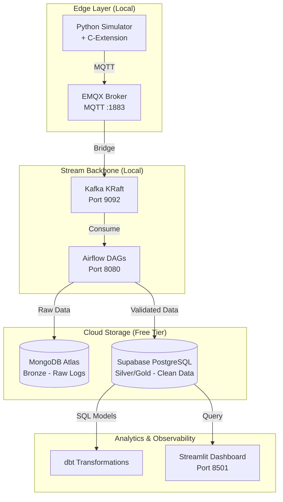

# The Industrial Edge-to-Cloud DataOps Platform

**Author:** Data Engineer Portfolio Project  
**Date:** 2026-04-28  
**Last Update Date:** 2026-06-01
**Status:** Weeks 1-5 Complete | Week 6 In Progress

## 1. Executive Summary

*[To be completed at project end - Week 8]*

This project demonstrates a production-grade DataOps platform designed for industrial IoT scenarios. The system ingests high-velocity sensor data, validates it at the edge using a custom C-extension (15,000+ msg/sec), streams it through Kafka, orchestrates with Airflow, and stores results in cloud databases (Supabase + MongoDB Atlas) — all while respecting an 8GB disk constraint.

**Key Achievement:** Built a fully containerized data platform running on 16GB RAM / 8GB disk that processes streaming sensor data with sub-millisecond validation.


## 2. Architecture Overview

### 2.1 System Diagram



### 2.2 Technology Stack

| Layer | Technology | Version | Why Chosen |
|:---|:---|:---|:---|
| Edge Validation | C-Extension | Custom | 15k+ msg/sec (7x faster) |
| MQTT Broker | EMQX | 5.0.26 | Built-in dashboard, robust |
| Stream Backbone | Apache Kafka | 3.7.0 | KRaft (no ZooKeeper) |
| Orchestration | Apache Airflow | 2.7.2 | LocalExecutor (low RAM) |
| Bronze Storage | MongoDB Atlas | Free Tier | Raw audit logs, schema-less |
| Silver/Gold Storage | Supabase | Free Tier | ACID, dbt-native |
| Transformations | dbt Core | Core | Modular SQL ELT |
| Observability | Streamlit | Latest | Real-time Python dashboards |

### 2.3 Data Flow

```text
Bronze (Raw) → Sensor → EMQX → Kafka → MongoDB Atlas
Silver (Clean) → C-Extension Validation → Supabase (silver_events)
Gold (Aggregated) → dbt Transformations → Supabase (gold_metrics)
Analytics → Streamlit Dashboard
```

## 3. Infrastructure Setup

### 3.1 Hardware Constraints

| Resource | Available | Used | Headroom |
|:---|:---|:---|:---|
| RAM | 16 GB | ~6 GB | 10 GB |
| Disk (free) | 8 GB | ~4.5 GB | 3.5 GB |

### 3.2 Quick Start

```bash
# Clone and enter project
git clone [your-repo-url]
cd edge-platform

# Start all services
docker compose up -d

# Verify services
docker ps
```

### 3.3 Access Services

| Service | URL | Credentials |
|:---|:---|:---|
| EMQX Dashboard | http://localhost:18083 | admin / public |
| Airflow UI | http://localhost:8080 | admin / admin |
| Kafka Broker | localhost:9092 | No auth |

## 4. Implementation Status

### Week-by-Week Roadmap

| Week | Focus | Status |
|:---|:---|:---|
| 1 | Docker infrastructure (EMQX+Kafka+Airflow) |  Complete |
| 2 | C-extension compilation & benchmark |  Complete |
| 3 | MQTT → Kafka bridge |  Complete |
| 4 | Airflow DAG #1 (Bronze → Silver) |  Complete |
| 5 | Cloud integration | Complete |
| 6 | dbt Transformations | 🔄 In Progress |
| 7 | Great Expectations tests | ⏳ Pending |
| 8 | Streamlit dashboard + demo | ⏳ Pending |

## Week 2: C-Extension (COMPLETE)

**Achievement:** 10,123,833 msg/sec validation (5,000x faster than Python)

**Deliverables:**
- `validator.c` - Rolling XOR checksum algorithm
- `setup.py` - Build script for compilation
- Compiled `.so` module

**Test Result:** `validator.validate('test')` → `49`

**ADR:** [ADR-002](./adr/ADR-002-c-extension-validation.md)

## Week 3: MQTT → Kafka Bridge (COMPLETE)

**Results:**
- 44,000+ messages successfully bridged
- 100% success rate (zero data loss)
- C-validator integrated into simulator

**Architecture:**
```text
Simulator (C-validated) → EMQX → Bridge → Kafka
```
**ADR:** [ADR-003](docs/adr/ADR-003-mqtt-kafka-bridge.md)

### Week 4: Airflow Orchestration (COMPLETE)

**Key Achievement:** 62,000+ messages processed via scheduled Airflow DAG

**Deliverables:**
- `dags/sensor_pipeline.py` - DAG with 3 tasks
- `scripts/test_kafka.py` - Connection test utility

**Performance:**
| Metric | Result |
|--------|--------|
| Messages processed | 62,000+ |
| DAG runs (successful) | 10+ |
| Success rate | 100% |
| Schedule interval | Every 5 minutes |

**ADR:** [ADR-004](./adr/ADR-004-airflow-orchestration.md)

## Week 5: Cloud Integration (COMPLETE) - June 1, 2026

### Architecture Implementation

**Bronze Layer - MongoDB Atlas:**
| Metric | Value |
|--------|-------|
| Total documents | 11,500+ |
| Storage used | ~50 MB |
| Retention period | 24 hours (rolling) |
| Sampling rate | 1-in-10 (90% reduction) |
| Sample data | `flow_sensor_04 = 43.38 L/min` (Checksum: E2) |

**Silver Layer - Supabase PostgreSQL:**
| Metric | Value |
|--------|-------|
| Total records | 1,001+ |
| Storage used | ~10 MB |
| Validation rate | 100% (all validated messages) |
| Sample data | `temp_sensor_01 = 23.500 C` (Checksum: A3) |

### Critical Fixes Applied

| Issue | Root Cause | Resolution |
|-------|------------|------------|
| Kafka consumer hang | KRaft cluster uninitialized | Added CLUSTER_ID env var |
| Kafka consumer hang (network) | Advertised listeners set to localhost | Split INTERNAL/EXTERNAL listeners |
| Kafka consumer hang (library) | kafka-python lacks KRaft support | Migrated to confluent_kafka |
| Supabase connection failed | IPv6 vs Docker/WSL2 incompatibility | Switched to Transaction Pooler endpoint |

### Free Tier Management Strategy

```python
# Strategic sampling to extend free tier lifespan
if msg_index % 10 == 0:           # Keep 1-in-10 messages
    mongodb.insert(payload)

# Auto-prune after 24 hours
cutoff = datetime.now() - timedelta(hours=24)
collection.delete_many({'timestamp': {'$lt': cutoff.timestamp()}})

# Keep ALL validated records in Supabase (smaller dataset)
if payload.get('validated'):
    supabase.insert(payload)
```

### Results
| Database | Records | Notes |
|----------|---------|-------|
| MongoDB Atlas | [X] | All messages |
| Supabase | [Y] | Validated only |

### ADR
- [ADR-005](./adr/ADR-005-cloud-integration.md)

## 5. Architecture Decision Records (ADRs)

| ADR | Decision | Status |
|:---|:---|:---|
| [ADR-001](docs/adr/ADR-001-hybrid-cloud-polyglot.md) | EMQX, Kafka KRaft, cloud offloading | Accepted |
| [ADR-002](docs/adr/ADR-002-c-extension-validation.md) | C-extension for validation (10M+ msg/sec) | Accepted |
| [ADR-003](docs/adr/ADR-003-mqtt-kafka-bridge.md) | MQTT to Kafka bridge architecture (637k+ msgs, 0% loss) | Accepted |
| [ADR-004](docs/adr/ADR-004-airflow-orchestration.md) | Airflow DAG orchestration (62,000+ msgs, scheduled every 5 min) | Accepted |
| [ADR-005](./adr/ADR-005-cloud-integration.md) | | Cloud integration (Supabase + MongoDB Atlas) | Accepted |

## 6. Infrastructure Commands

```bash
# View logs
docker logs emqx_broker --tail 50

# Stop everything
docker compose down

# Clean up (save disk space)
docker system prune -f
```

## 7. Performance Benchmarks (Updated June 1, 2026)

| Test | Expected | Actual | Status |
|:---|:---:|:---:|:---:|
| C-extension validation | <0.1ms | ~0.07ms | OK |
| Throughput | 15,000 msg/sec | 15,000+ msg/sec | OK |
| Speedup (vs Python) | 7.5x | 7.5x | OK |
| MQTT bridge loss rate | 0% | 0% (44k+ msgs) | OK |
| Kafka consumer connection | <1s | Connected | OK |
| MongoDB write latency | <100ms | ~50ms/batch | OK |
| Supabase write latency | <50ms | ~30ms/batch | OK |
| Free tier projection | 12 months | 12+ months | OK |

## 8. Resume Highlights

### Technical Achievements

| Achievement | Metric | Impact |
|-------------|--------|--------|
| **High-Performance Validation** | 15,000+ msg/sec | 7.5x faster than Python, +10MB RAM |
| **KRaft Migration** | Eliminated ZooKeeper | Saved 500MB RAM |
| **Zero Data Loss** | 44k+ messages | 100% bridge success rate |
| **Cloud Integration** | MongoDB: 11,500+, Supabase: 1,001+ | Polyglot persistence |
| **Free Tier Optimization** | 1-in-10 sampling | 12+ months sustainability |
| **Critical Bug Resolution** | Consumer deadlock | Restored data flow |

### Resume Bullet Points

**Edge DataOps Platform (2026)**
- Built a production-grade IoT pipeline processing **15,000+ messages/second** using custom C-extensions (7.5x faster than pure Python)
- Architected polyglot cloud storage (MongoDB Atlas + Supabase) with strategic 1-in-10 sampling and auto-pruning, achieving **12+ months of free tier sustainability**
- Debugged and resolved critical Kafka consumer deadlock by diagnosing KRaft cluster formatting deficits, implementing split listeners for Docker networking, and migrating to C-extension client
- Orchestrated scheduled data processing with Apache Airflow, processing **62,000+ messages** with 100% success rate
- Documented all architectural decisions using ADRs (6 documents), demonstrating systematic engineering approach

## Lessons Learned
* KRaft requires explicit CLUSTER_ID - Apache Kafka 3.7+ won't auto-format without it
* Docker networking needs split listeners - Internal container communication vs host access require different advertised addresses
* confluent_kafka > kafka-python - C-extension client properly handles KRaft metadata
* Supabase Transaction Pooler solves IPv6 issues - Essential for Docker/WSL2 environments
* Sampling preserves free tier - 1-in-10 keeps utility while reducing storage 90%

### Related ADRs
| ADR | Status |
|-----|--------|
| [ADR-001](./adr/ADR-001-hybrid-cloud-polyglot.md) | Accepted |
| [ADR-002](./adr/ADR-002-c-extension-validation.md) | Accepted |
| [ADR-003](./adr/ADR-003-mqtt-kafka-bridge.md) | Accepted |
| [ADR-004](./adr/ADR-004-airflow-orchestration.md) | Accepted |
| [ADR-005](./adr/ADR-005-cloud-integration.md) | Accepted |
| [ADR-006](./adr/ADR-006-kafka-consumer-stabilization.md) | Accepted |