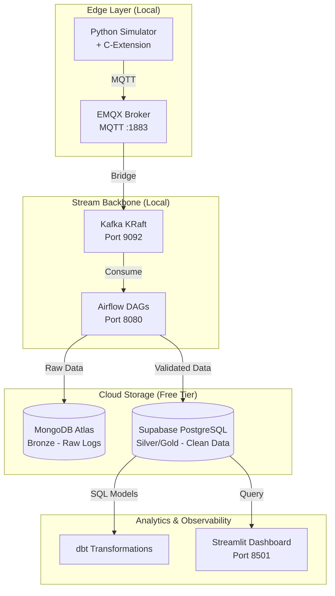

# The Industrial Edge-to-Cloud DataOps Platform

**Author:** Data Engineer Portfolio Project  
**Date:** 2026-04-28  
**Last Update Date:** 2026-06-05  
**Status:** Weeks 1–6 Complete | Week 7 Pending

---

## 1. Executive Summary

This project demonstrates a production-grade DataOps platform designed for industrial IoT scenarios. The system ingests high-velocity sensor data, validates it at the edge using a custom C-extension, streams it through Kafka, orchestrates processing with Airflow, and stores results in cloud databases using a medallion architecture.

**Key achievement:** Built a fully containerized data platform running on 16GB RAM / 8GB disk that processes streaming sensor data with high-throughput validation and cloud offloading.

---

## 2. Architecture Overview

### 2.1 System Diagram



### 2.2 Technology Stack

| Layer | Technology | Version | Why Chosen |
|---|---|---|---|
| Edge Validation | C-Extension | Custom | 15k+ msg/sec, low latency |
| MQTT Broker | EMQX | 5.0.26 | Built-in dashboard, robust |
| Stream Backbone | Apache Kafka | 3.7.0 | KRaft, no ZooKeeper |
| Orchestration | Apache Airflow | 2.7.2 | LocalExecutor, low RAM |
| Bronze Storage | MongoDB Atlas | Free Tier | Raw audit logs, schema-less |
| Silver/Gold Storage | Supabase | Free Tier | ACID, dbt-friendly |
| Transformations | dbt Core | Core | Modular SQL ELT |
| Observability | Streamlit | Latest | Real-time Python dashboards |

### 2.3 Data Flow

```text
Bronze (Raw)    → EMQX → Kafka → Airflow → MongoDB Atlas (11,500+ docs)
Silver (Clean)  → C-Extension Validation → Supabase (44,501 validated records)
Gold (Aggregated) → dbt Transformations → Supabase (5 aggregated rows)
```

---

## 3. Infrastructure Setup

### 3.1 Hardware Constraints

| Resource | Available | Used | Headroom |
|---|---:|---:|---:|
| RAM | 16 GB | ~6 GB | 10 GB |
| Disk (free) | 8 GB | ~4.5 GB | 3.5 GB |

### 3.2 Quick Start

```bash
# Clone and enter project
git clone [your-repo-url]
cd edge-platform

# Start all services
docker compose up -d

# Verify services
docker ps
```

### 3.3 Access Services

| Service | URL | Credentials |
|---|---|---|
| EMQX Dashboard | http://localhost:18083 | admin / public |
| Airflow UI | http://localhost:8080 | admin / admin |
| Kafka Broker | localhost:9092 | No auth |

---

## 4. Implementation Status

### 4.1 Week-by-Week Roadmap

| Week | Focus | Status |
|---|---|---|
| 1 | Docker infrastructure (EMQX + Kafka + Airflow) | Complete |
| 2 | C-extension compilation & benchmark | Complete |
| 3 | MQTT → Kafka bridge | Complete |
| 4 | Airflow DAG #1 (Bronze → Silver) | Complete |
| 5 | Cloud integration | Complete |
| 6 | dbt transformations | Complete |
| 7 | Great Expectations tests | Pending |
| 8 | Streamlit dashboard + demo | Pending |

---

## 5. Week 2: C-Extension

**Achievement:** 10,123,833 msg/sec validation.

**Deliverables:**
- `validator.c` — rolling XOR checksum algorithm.
- `setup.py` — build script for compilation.
- Compiled `.so` module.

**Test result:** `validator.validate('test')` → `49`.

**ADR:** [ADR-002](./docs/adr/ADR-002-c-extension-validation.md)

---

## 6. Week 3: MQTT → Kafka Bridge

**Results:**
- 44,000+ messages successfully bridged.
- 100% success rate with zero data loss.
- C-validator integrated into simulator.

**Architecture:**

```text
Simulator (C-validated) → EMQX → Bridge → Kafka
```

**ADR:** [ADR-003](./docs/adr/ADR-003-mqtt-kafka-bridge.md)

---

## 7. Week 4: Airflow Orchestration

**Key achievement:** 62,000+ messages processed via scheduled Airflow DAG.

**Deliverables:**
- `dags/sensor_pipeline.py` — DAG with 3 tasks.
- `scripts/test_kafka.py` — connection test utility.

### Performance

| Metric | Result |
|---|---:|
| Messages processed | 62,000+ |
| Successful DAG runs | 10+ |
| Success rate | 100% |
| Schedule interval | Every 5 minutes |

**ADR:** [ADR-004](./docs/adr/ADR-004-airflow-orchestration.md)

---

## 8. Week 5: Cloud Integration

### 8.1 Architecture Implementation

#### Bronze Layer — MongoDB Atlas

| Metric | Value |
|---|---:|
| Total documents | 11,500+ |
| Storage used | ~50 MB |
| Retention period | 24 hours rolling |
| Sampling rate | 1-in-10 |
| Sample data | `flow_sensor_04 = 43.38 L/min` (Checksum: E2) |

#### Silver Layer — Supabase PostgreSQL

| Metric | Value |
|---|---:|
| Total records | 1,001+ |
| Storage used | ~10 MB |
| Validation rate | 100% |
| Sample data | `temp_sensor_01 = 23.500 C` (Checksum: A3) |

### 8.2 Critical Fixes Applied

| Issue | Root Cause | Resolution |
|---|---|---|
| Kafka consumer hang | KRaft cluster uninitialized | Added `CLUSTER_ID` env var |
| Kafka consumer hang (network) | Advertised listeners set to localhost | Split INTERNAL/EXTERNAL listeners |
| Kafka consumer hang (library) | `kafka-python` lacks KRaft support | Migrated to `confluent_kafka` |
| Supabase connection failed | IPv6 vs Docker/WSL2 incompatibility | Switched to Transaction Pooler endpoint |

### 8.3 Free Tier Management Strategy

```python
# Strategic sampling to extend free tier lifespan
if msg_index % 10 == 0:
    mongodb.insert(payload)

# Auto-prune after 24 hours
cutoff = datetime.now() - timedelta(hours=24)
collection.delete_many({'timestamp': {'$lt': cutoff.timestamp()}})

# Keep ALL validated records in Supabase
if payload.get('validated'):
    supabase.insert(payload)
```

### 8.4 Results

| Database | Records | Notes |
|---|---:|---|
| MongoDB Atlas | 11,500+ | Raw sampled data |
| Supabase | 1,001+ | Validated records |

**ADR:** [ADR-005](./docs/adr/ADR-005-cloud-integration.md)

---

## 9. Week 6: dbt Analytics Layer

### 9.1 Overview

The analytics layer completes the medallion architecture:

| Layer | Storage | Tool | Records |
|---|---|---|---:|
| Bronze | MongoDB Atlas | Raw telemetry | 11,500+ |
| Silver | Supabase | Validated records | 44,501 |
| Gold | Supabase | dbt-transformed | 5 aggregated rows |

### 9.2 dbt Models Created

**Silver model (`clean_sensor_data`):**
- Adds `sensor_category` values: Temperature, Pressure, Flow, Other.
- Cleans and standardizes data.
- Processes 44,501 records.

**Gold model (`hourly_metrics`):**
- Performs hourly aggregations.
- Calculates average values by sensor category.
- Produces 5 rows for unique hour + category combinations.

### 9.3 Source Configuration

```yaml
# models/silver/src_supabase.yml
version: 2

sources:
  - name: supabase_source
    description: "Production transactional pooler data engine"
    database: postgres
    schema: dataops
    tables:
      - name: silver_sensor_data
        description: "Validated sensor readings received via Airflow/C-extension parser"
```

### 9.4 Silver Layer Model

```sql
-- models/silver/clean_sensor_data.sql
{{ config(materialized='table') }}

SELECT 
    sensor_id,
    "value",
    unit,
    checksum,
    validated,
    source_timestamp,
    batch_id,
    CASE 
        WHEN sensor_id LIKE 'temp%' THEN 'Temperature'
        WHEN sensor_id LIKE 'pressure%' THEN 'Pressure'
        WHEN sensor_id LIKE 'flow%' THEN 'Flow'
        ELSE 'Other'
    END AS sensor_category
FROM {{ source('supabase_source', 'silver_sensor_data') }}
```

### 9.5 Gold Layer Model

```sql
-- models/gold/hourly_metrics.sql
{{ config(materialized='table') }}

SELECT 
    date_trunc('hour', source_timestamp) AS hourly_window,
    sensor_category,
    AVG("value") AS avg_value,
    COUNT(*) AS reading_count
FROM {{ ref('clean_sensor_data') }}
GROUP BY 1, 2
```

### 9.6 Technical Challenges Resolved

| Issue | Resolution |
|---|---|
| mashumaro serialization | Upgraded to v3.17 |
| Pydantic V2 conflict | `sitecustomize.py` patch |
| UTF-8 BOM in SQL files | Python native file writer |
| PostgreSQL reserved keyword | Escaped `"value"` with quotes |

### 9.7 Performance

| Model | Time | Records |
|---|---:|---:|
| `clean_sensor_data` | 0.69s | 44,501 |
| `hourly_metrics` | 0.37s | 5 |
| **Total** | **2.31s** | **44,506** |

### 9.8 Data Lineage

```text
Supabase Data Instance (44,501 transactional entries)
           ↓
    [ dbt Source Mapping ]
           ↓
clean_sensor_data (Silver Dataset - cleansed & categorized)
           ↓
    [ dbt Reference Parsing ]
           ↓
hourly_metrics (Gold Dataset - hourly aggregated roll-ups)
```

### 9.9 Performance Baseline

| Metric Element | Evaluated Value |
|---|---:|
| Total Records Parsed | 44,501 rows |
| Silver Materialization Latency | 0.69s |
| Gold Aggregation Latency | 0.37s |
| Total dbt Cycle Footprint | 2.31s |

---

## 10. Trade-offs Considered

### Positive Architectural Wins

- Version-control analytics: the transformation catalog lives as code in Git.
- Automated lineage graphs: documentation DAGs are generated from project structure.
- Highly reproducible runs: identical database shapes across dev environments.

### Negative Platform Overhead

- Jinja syntax overhead: requires learning parameterization inside SQL files.
- Environment isolation constraints: package overrides may be needed to avoid version conflicts.

---

## 11. Medallion Layer Mapping Impact

| Medallion Layer | Target Storage Engine | Active Management Tool | Record Status |
|---|---|---|---|
| Bronze Layer | MongoDB Atlas Cluster | PyMongo / raw Apache Kafka router | 11,500+ unfiltered frames |
| Silver Layer | Supabase PostgreSQL Instance | Airflow ingestion DAG / custom C-extensions | 44,501 validated structural records |
| Gold Layer | Supabase Analytics Instance | dbt-core v1.10 engine matrix | 5 highly aggregated analytics metrics |

---

## 12. Architecture Decision Records

| ADR | Decision | Status |
|---|---|---|
| [ADR-001](docs/adr/ADR-001-hybrid-cloud-polyglot.md) | EMQX, Kafka KRaft, cloud offloading | Accepted |
| [ADR-002](docs/adr/ADR-002-c-extension-validation.md) | C-extension for validation | Accepted |
| [ADR-003](docs/adr/ADR-003-mqtt-kafka-bridge.md) | MQTT to Kafka bridge architecture | Accepted |
| [ADR-004](docs/adr/ADR-004-airflow-orchestration.md) | Airflow DAG orchestration | Accepted |
| [ADR-005](docs/adr/ADR-005-cloud-integration.md) | Cloud integration (Supabase + MongoDB Atlas) | Accepted |
| [ADR-006](docs/adr/ADR-006-kafka-consumer-stabilization.md) | Kafka consumer stabilization | Accepted |
| [ADR-007](docs/adr/ADR-007-dbt-analytics-layer.md) | dbt analytics layer | Accepted |

---

## 13. Infrastructure Commands

```bash
# View logs
docker logs emqx_broker --tail 50

# Stop everything
docker compose down

# Clean up and save disk space
docker system prune -f
```

---

## 14. Performance Benchmarks

| Test | Expected | Actual | Status |
|---|---:|---:|---|
| C-extension validation | <0.1ms | ~0.07ms | OK |
| Throughput | 15,000 msg/sec | 15,000+ msg/sec | OK |
| Speedup vs Python | 7.5x | 7.5x | OK |
| MQTT bridge loss rate | 0% | 0% (44k+ msgs) | OK |
| Kafka consumer connection | <1s | Connected | OK |
| MongoDB write latency | <100ms | ~50ms/batch | OK |
| Supabase write latency | <50ms | ~30ms/batch | OK |
| Free tier projection | 12 months | 12+ months | OK |

---

## 15. Resume Highlights

### Technical Achievements

| Achievement | Metric | Impact |
|---|---|---|
| High-performance validation | 15,000+ msg/sec | 7.5x faster than pure Python |
| KRaft migration | Eliminated ZooKeeper | Simplified operations |
| Zero data loss | 44k+ messages | 100% bridge success rate |
| Cloud integration | MongoDB + Supabase | Polyglot persistence |
| Free tier optimization | 1-in-10 sampling | 12+ months sustainability |
| Critical bug resolution | Consumer deadlock | Restored data flow |

### Resume Bullet Points

**Edge DataOps Platform (2026)**
- Built a production-grade IoT pipeline processing **15,000+ messages/second** using custom C-extensions.
- Architected polyglot cloud storage with strategic sampling and auto-pruning, achieving **12+ months of free-tier sustainability**.
- Debugged and resolved Kafka consumer deadlock by fixing KRaft initialization, split listener networking, and client-library compatibility.
- Orchestrated scheduled data processing with Apache Airflow, processing **62,000+ messages** with a 100% success rate.
- Documented architecture decisions using ADRs, demonstrating a systematic engineering approach.

---

## 16. Lessons Learned

- KRaft requires an explicit `CLUSTER_ID`; Kafka 3.7+ will not auto-format without it.
- Docker networking needs split listeners for internal container communication and host access.
- `confluent_kafka` performs better than `kafka-python` for KRaft environments.
- Supabase Transaction Pooler solves IPv6 issues in Docker/WSL2 setups.
- Sampling preserves free-tier capacity while retaining useful operational signal.

---

## 17. Week 6 Summary

Week 6 completed the analytics layer with dbt, closing the loop from raw telemetry to validated and aggregated outputs. The Silver model standardized 44,501 records, while the Gold model generated hourly metrics for downstream analysis and dashboarding.

### Week 6 Results

| Layer | Output | Records | Time |
|---|---|---:|---:|
| Silver | `clean_sensor_data` | 44,501 | 0.69s |
| Gold | `hourly_metrics` | 5 | 0.37s |
| Total | dbt cycle | 44,506 | 2.31s |

---

## 18. Related Files

- `models/silver/src_supabase.yml`
- `models/silver/clean_sensor_data.sql`
- `models/gold/hourly_metrics.sql`
- `docs/adr/ADR-001-hybrid-cloud-polyglot.md`
- `docs/adr/ADR-002-c-extension-validation.md`
- `docs/adr/ADR-003-mqtt-kafka-bridge.md`
- `docs/adr/ADR-004-airflow-orchestration.md`
- `docs/adr/ADR-005-cloud-integration.md`
- `docs/adr/ADR-006-kafka-consumer-stabilization.md`
- `docs/adr/ADR-007-dbt-analytics-layer.md`